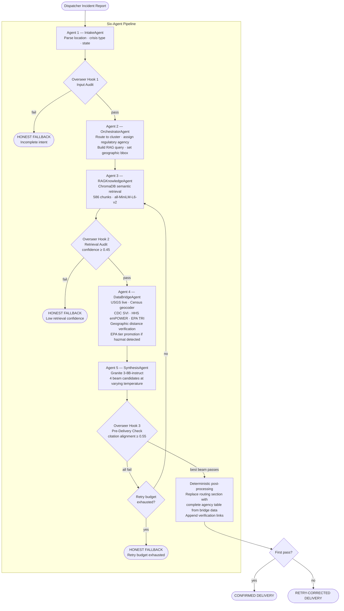
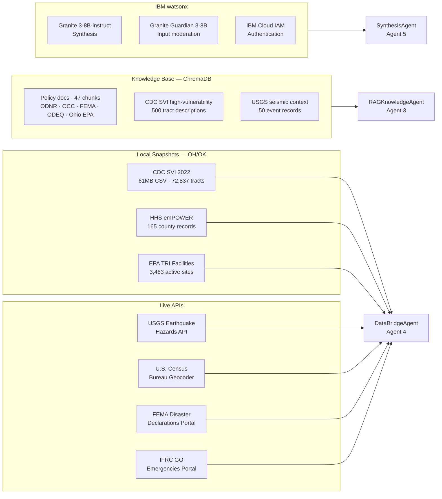
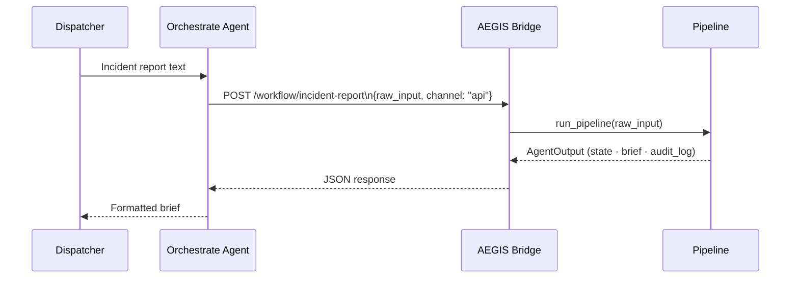

# AEGIS — Agentic Emergency Geospatial Intelligence Synthesizer

**IBM SkillsBuild AI Experiential Learning Lab 2026**  
**Track: Government & Public Services**  
**Author: Shawn Blackman** | B.S. Environmental Science, Lehman College (CUNY)

---

## The Problem

When a spatially predictable seismic crisis — driven by disposal-well volume and pressure dynamics — strikes a high-vulnerability community, the emergency response chain breaks at the coordination layer. The problem is not the absence of available data. It is that USGS seismic records, CDC census vulnerability scores, HHS electricity-dependent resident counts, EPA hazmat facility registries, and state regulatory contacts exist in separate systems that do not communicate under pressure.

Manual cross-referencing. Disconnected APIs. Cognitive overload.


> *The system was designed for agency independence. The crisis requires interdependence.*

---

## The Solution

**AEGIS** is a six-agent AI pipeline that acts as an invisible coordinator for Emergency Operations Center supervisors managing induced seismicity events. A dispatcher submits a free-text incident report. AEGIS fuses live federal data, runs the output through three governance checkpoints, and returns a validated inter-agency routing brief in under 30 seconds.

The brief contains exactly three sections, always:

- **[HAZARD STATUS]** — confirmed USGS magnitude, depth, location, distance verification, and EPA TRI compound hazmat risk
- **[DEMOGRAPHIC RISK (SVI)]** — CDC Social Vulnerability Index percentile, HHS emPOWER electricity-dependent resident count, census tract identification
- **[INTER-AGENCY ROUTING]** — tiered agency table (Tier 1 immediate, Tier 2 within the hour, Tier 3 as warranted), with EPA environmental agency promoted to Tier 1 if hazmat facilities are detected

---

## Pipeline Architecture



---

## Data Sources



---

## The Three Output States


| State | Condition | Trust Signal |
|---|---|---|
| CONFIRMED DELIVERY | All three hooks passed on first attempt | Full governance validation |
| RETRY-CORRECTED DELIVERY | Failed at least one hook; passed within retry budget (max 2) | System self-corrected |
| HONEST FALLBACK | Retry budget exhausted | System reported its limit honestly |

> *A system that cannot say "I don't know" gives less weight to the times it says "I know."*

---

## Key Design Decisions

### 1. Retrieval Before Reasoning
The RAGKnowledgeAgent retrieves policy context and vulnerability data **before** the Orchestrator reasons about agency routing. The knowledge base constrains the reasoning. An agent that reasons first confirms its own assumptions — in an emergency context, confident-wrong is the worst failure mode.

### 2. Beam Search Over Greedy Decoding
The SynthesisAgent generates `BEAM_WIDTH=4` candidate responses at temperatures 0.30, 0.45, 0.60, 0.75. The Overseer selects the candidate with the highest **citation alignment score** — semantic cosine similarity between the output and the retrieved source context — not the highest token probability.

### 3. Deterministic Routing Table
The `[INTER-AGENCY ROUTING]` section is not LLM-generated. After the Overseer scores and selects the best beam, `pipeline.py` replaces the routing section with a table built directly from bridge data. This guarantees all agencies appear, tiers are correct, and EPA tier promotion under compound hazmat conditions is always reflected.

### 4. Geographic Distance Verification
The DataBridgeAgent calculates the haversine distance between the reported incident location and the nearest USGS catalogued event. Three response tiers:
- **< 30 km** — Co-located: event confirmed near reported location
- **30–50 km** — Nearest regional event: moderate proximity
- **> 50 km** — No USGS-verified seismic activity at reported location; notes possible catalogue lag (5–15 min) or location correction needed

### 5. EPA Tier Promotion
If EPA TRI-listed hazmat facilities are detected within ±0.25° of the reported incident, the environmental agency (Ohio EPA or ODEQ) is automatically promoted from Tier 2 to Tier 1 in the routing matrix, with a ⚠ COMPOUND HAZMAT RISK warning prepended to its role. This is evidence-driven conditional routing — bridge data changes the governance output.

### 6. Proactive Three-Hook Governance


- **Input Audit** — catches structuring failures before reasoning begins
- **Retrieval Audit** — low-confidence retrieval does not proceed to synthesis
- **Pre-Delivery Check** — semantic citation alignment scored across all beam candidates; unfilled template detection; required section structure enforcement

---

## IBM Tools

| Tool | Role |
|---|---|
| IBM watsonx.ai (Granite 3-8B-instruct) | SynthesisAgent — beam candidate generation |
| IBM Granite Guardian 3-8B | OverseerAgent — input and retrieval moderation |
| IBM watsonx Orchestrate | Front-end — single tool registration, ReAct agent |
| IBM watsonx.governance | Overseer audit log, model monitoring |

---

## Orchestrate Integration

AEGIS is registered in watsonx Orchestrate as a **single tool**: `run_full_crisis_workflow` → `POST /workflow/incident-report`.

The agent receives a dispatcher's incident text, calls the tool once, and returns the full brief. No chaining, no multi-step decomposition.



### Starting the bridge

```bash
python start_bridge.py
```

`start_bridge.py` handles uvicorn startup, ngrok tunnel, YAML URL patching, and a regression pair automatically. The ngrok URL is patched into `orchestrate/skill_bridge_openapi.yaml` on each startup.

---

## Project Structure

```
agentic-knowledge-synthesizer/
├── pipeline.py                    # Six-agent orchestration + post-processing
├── config.py                      # All constants and thresholds
├── start_bridge.py                # Bridge startup: uvicorn + ngrok + regression
├── requirements.txt
│
├── agents/
│   ├── intake_agent.py            # Agent 1: intent parsing · location resolution
│   ├── orchestrator_agent.py      # Agent 2: cluster routing · agency assignment
│   ├── rag_knowledge_agent.py     # Agent 3: ChromaDB semantic retrieval
│   ├── data_bridge_agent.py       # Agent 4: USGS · SVI · emPOWER · TRI · distance
│   ├── overseer_agent.py          # Agent 5: three-hook governance · moderation
│   └── synthesis_agent.py         # Agent 6: Granite beam generation
│
├── rag/
│   ├── ingest.py                  # Knowledge base ingestion (run once)
│   ├── vector_store.py            # ChromaDB client
│   └── retriever.py               # Semantic search + confidence scoring
│
├── governance/
│   ├── output_states.py           # OutputState enum · AgentOutput dataclass
│   └── audit_log.py               # Overseer decision logging
│
├── orchestrate/
│   ├── skill_server.py            # FastAPI bridge · /workflow/incident-report
│   ├── skill_bridge_openapi.yaml  # Single-tool OpenAPI spec for Orchestrate
│   └── registration_guide.md      # Agent config · evaluation notes
│
├── data/
│   ├── svi_2022_us_tract.csv      # CDC SVI 2022 (61MB · not in git)
│   ├── empower_oh_ok.json         # HHS emPOWER OH/OK snapshot (165 counties)
│   ├── tri_facilities_oh_ok.json  # EPA TRI OH/OK snapshot (3,463 facilities)
│   └── policy_docs/
│       ├── blackman_2025_full.txt
│       ├── nifog_2025_summary.txt
│       └── agency_response_operations.txt  # ODNR · OCC · FEMA operational protocols
│
└── tests/
    └── test_units.py              # 52 pure unit tests · no network · no LLM
```

---

## Setup

### Prerequisites
- Python 3.11+
- [uv](https://github.com/astral-sh/uv) — fast Python package manager
- IBM Cloud account with watsonx.ai access
- ngrok account (free tier)

### Install

```bash
cd ~/src
git clone https://github.com/sh4wnbk/agentic-knowledge-synthesizer.git
cd agentic-knowledge-synthesizer
uv venv .ibm_survival_gap
source .ibm_survival_gap/bin/activate
uv pip install -r requirements.txt
```

### Credentials

```bash
cp .env.example .env
# Fill in: WATSONX_API_KEY, WATSONX_PROJECT_ID, WATSONX_URL
```

### Seed the knowledge base (run once)

```bash
python rag/ingest.py
```

### Start the bridge

```bash
python start_bridge.py
```

### Run unit tests

```bash
pytest tests/test_units.py -v
# 52 tests · no network required · no LLM required
```

---

## Governance Thresholds

| Threshold | Value | Source |
|---|---|---|
| `CONFIDENCE_THRESHOLD` | 0.45 | Calibrated for all-MiniLM-L6-v2 |
| `CITATION_ALIGN_THRESHOLD` | 0.55 | Local prototype (all-MiniLM-L6-v2 + OH/OK knowledge base) |
| `SVI_THRESHOLD` | 0.75 | Blackman (2025) — top vulnerability quartile |
| `SEISMIC_MIN_MAGNITUDE` | 1.5 | Demo threshold |
| `TRI_PROXIMITY_RADIUS_DEG` | 0.25° | ≈ 25 km — tight incident bbox for hazmat |
| `BEAM_WIDTH` | 4 | Diversity vs. API cost balance |
| `MAX_RETRIES` | 2 | Retry budget before honest fallback |

---

## Known Limitations

- **Live USGS lag** — seismic events appear in the USGS catalogue 5–15 minutes after occurrence. The geographic distance note explicitly flags when no verified activity exists at the reported location.
- **emPOWER and TRI are local snapshots** — fetched at project time, not real-time. Production would call live APIs on each request.
- **FEMA and IFRC** — verification links only; no live disaster declaration data is ingested.
- **ngrok tunnel** — the bridge is exposed via a development tunnel tied to the local machine. Production deployment requires a persistent host (IBM Code Engine or equivalent).
- **Citation alignment threshold** — 0.55 is calibrated for the local `all-MiniLM-L6-v2` model against the Ohio/Oklahoma-weighted knowledge base. Production with IBM watsonx embeddings would raise this to 0.65+.
- **Semantic match evaluation in Orchestrate** — Orchestrate's built-in semantic match metric is not valid for this system. AEGIS returns live data; the USGS event, SVI score, and TRI facilities change between runs. The authoritative quality signal is the internal governance layer (Overseer audit log), not a fixed expected-output comparison. See `orchestrate/registration_guide.md`.

---

## References

- FEMA (2024) 20 Years of NIMS
- CISA (2025) NIFOG v2.02
- USGS (2024) Circular 1509: Induced Seismicity Strategic Vision
- ODNR — Ohio Induced Seismicity Traffic Light System
- OCC — Oklahoma Corporation Commission Traffic Light Protocol
- CDC/ATSDR Social Vulnerability Index 2022
- HHS emPOWER Map — Electricity-Dependent Medicare Beneficiaries
- EPA Toxic Release Inventory (TRI) Program
- Blackman, S. (2025) Mapping Disparate Risk: Disposal Well-Induced Seismicity and Social Vulnerability in Ohio and Oklahoma

---

*IBM SkillsBuild AI Experiential Learning Lab | Government & Public Services Track*
