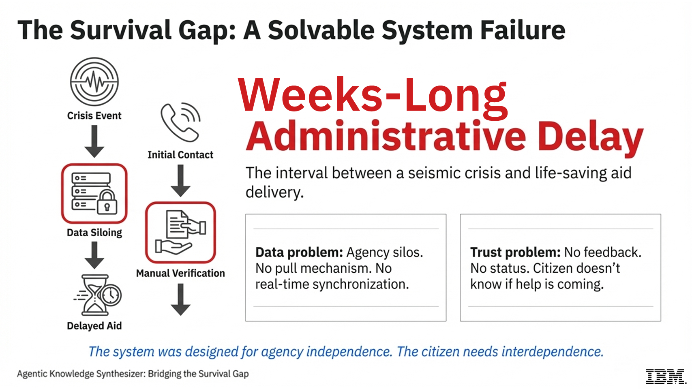
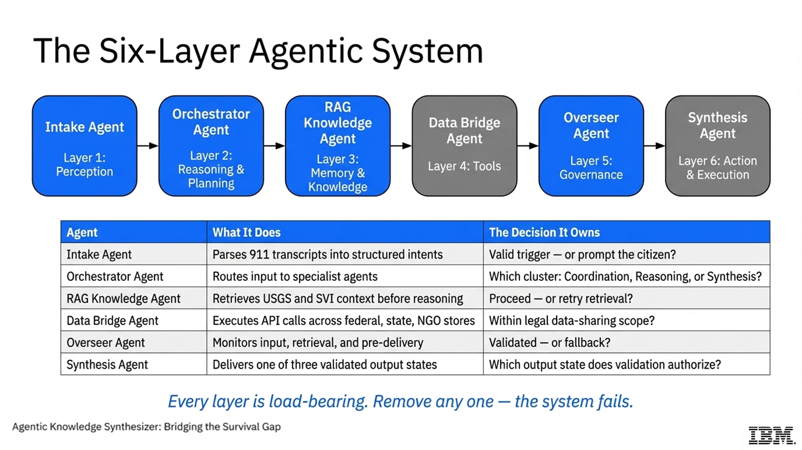
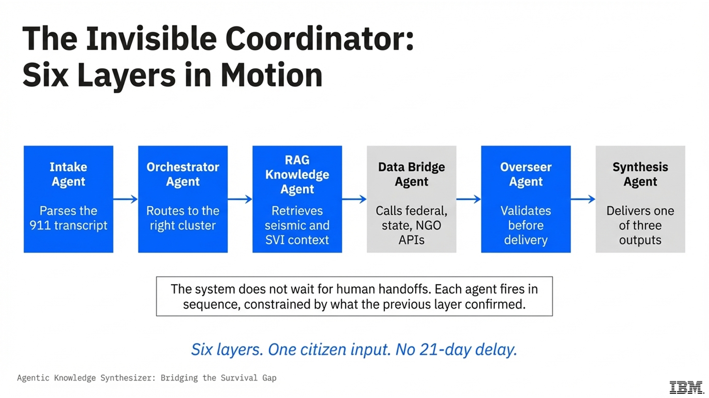
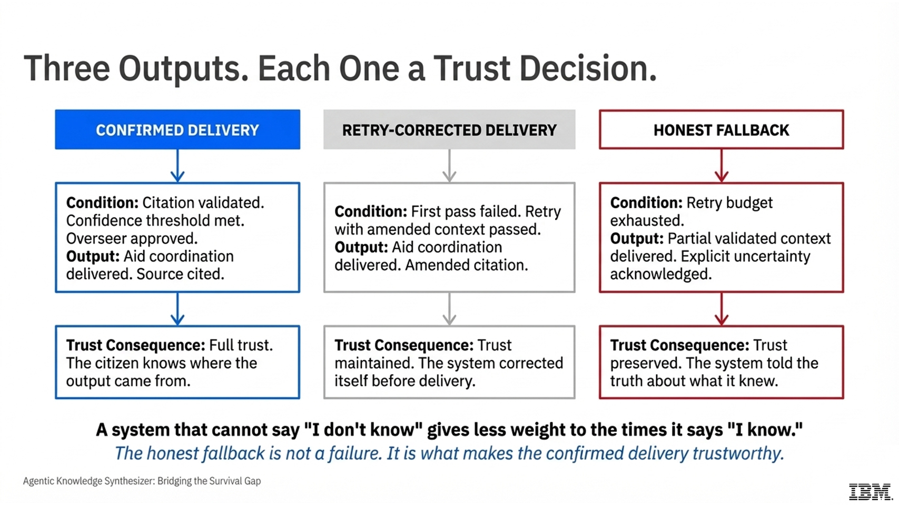
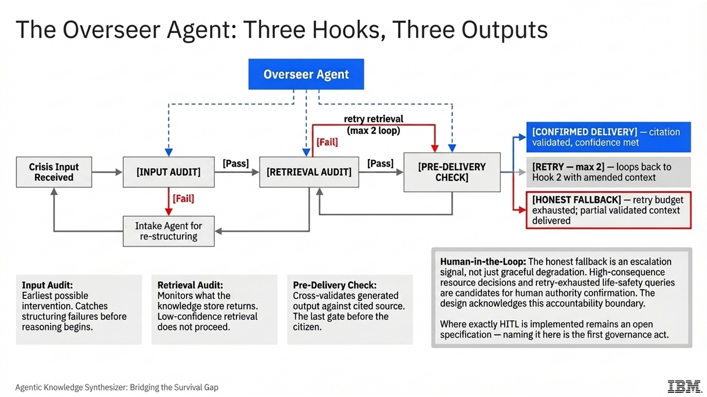
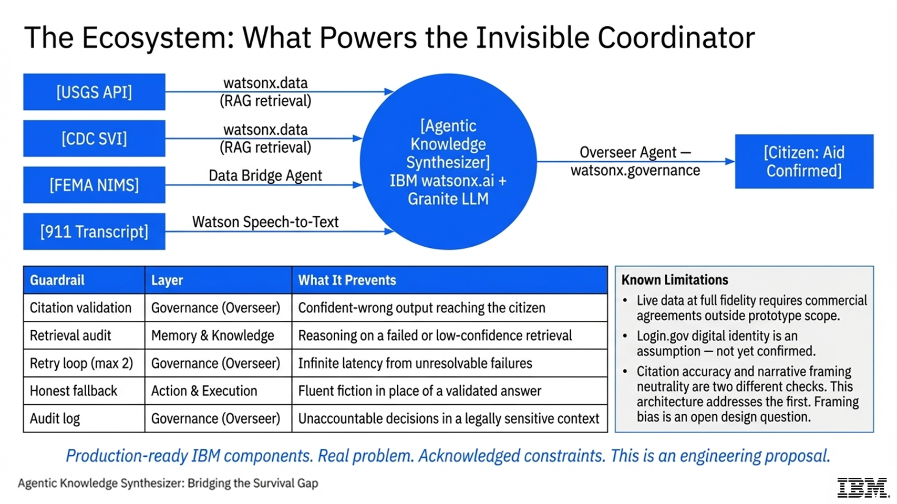

# Agentic Knowledge Synthesizer: Bridging the Survival Gap

**IBM SkillsBuild AI Experiential Learning Lab**
**Track: Government & Public Services**
**Author: Shawn Blackman** | B.S. Environmental Science, Lehman College (CUNY)

---

## The Problem

When a spatially predictable seismic crisis — driven by disposal‑well volume and pressure dynamics — strikes a high‑vulnerability community, residents face weeks‑long administrative delay before receiving aid. The problem is not the absence of available assistance — it is that federal, state, and NGO data systems still do not talk to one another.

Manual verification. Disconnected APIs. Paper forms. Cognitive overload.



> *The system was designed for agency independence. The citizen needs interdependence.*

---

## The Solution

An **Agentic Knowledge Synthesizer** that acts as an invisible coordinator — a six-agent AI pipeline built on IBM watsonx that:

- Parses unstructured 911 transcripts via Watson Speech-to-Text
- Retrieves real-time seismic and social vulnerability context via RAG before any reasoning begins
- Cross-references USGS seismic events with CDC Social Vulnerability Index tracts, while applying state-specific regulatory logic (ODNR Traffic Light System for Ohio; OCC Plug-back regulations for Oklahoma).
- Bridges federal (FEMA), state, and NGO data silos via authorized API calls
- Validates every output before delivery via a proactive Overseer Agent
- Delivers one of three validated output states — never fluent fiction

---

## Architecture



### The Six Agents

```
Crisis Input (911 transcript / text)
        │
        ▼
┌─────────────────┐
│  Intake Agent   │  Layer 1: Perception
│  Watson STT     │  Parses unstructured input → structured intent
└────────┬────────┘
         │
         ▼
┌─────────────────┐
│  Orchestrator   │  Layer 2: Reasoning & Planning
│  Agent          │  Routes to Coordination / Reasoning clusters. Implements regional inference logic: Ohio Cluster (proximity-based pore pressure diffusion)  
└────────┬────────┘  vs. Oklahoma Cluster (basin-wide hydraulic connectivity).
         │
         ▼
┌─────────────────┐
│  RAG Knowledge  │  Layer 3: Memory & Knowledge  ← Retrieval before reasoning
│  Agent          │  ChromaDB → USGS + CDC SVI semantic retrieval
└────────┬────────┘
         │
         ▼
┌─────────────────┐
│  Data Bridge    │  Layer 4: Tools
│  Agent          │  FEMA NIMS, NGO APIs, Login.gov identity
└────────┬────────┘
         │
         ▼
┌─────────────────┐
│  Overseer       │  Layer 5: Governance  ← Three hooks, proactive not reactive
│  Agent          │  Input Audit → Retrieval Audit → Pre-Delivery Check
└────────┬────────┘
         │
    ┌────┴─────────────────┐
    ▼                      ▼
┌──────────┐         ┌──────────────┐
│Confirmed │         │    Honest    │
│Delivery  │         │   Fallback   │
└──────────┘         └──────────────┘
```

### Pipeline: How a Crisis Input Becomes Aid Delivery



---

## The Three Output States



| State | Condition | Trust Consequence |
|---|---|---|
| Confirmed Delivery | Citation validated. Confidence met. Overseer approved. | Full trust. Citizen knows the source. |
| Retry-Corrected Delivery | First pass failed. Retry passed. | Trust maintained. System corrected itself. |
| Honest Fallback | Retry budget exhausted. | Trust preserved. System told the truth. |

> *A system that cannot say "I don't know" gives less weight to the times it says "I know."*

---

## Key Design Decisions

### 1. Retrieval Before Reasoning
The RAG Knowledge Agent retrieves USGS seismic event data and CDC SVI census tract context **before** the Orchestrator reasons about resource allocation. The knowledge base constrains the reasoning. An agent that reasons first confirms its own assumptions — and in an emergency aid context, confident-wrong is the worst failure mode.

### 2. Beam Search Over Greedy Decoding
The Synthesis Agent generates `BEAM_WIDTH=4` candidate responses at varying temperatures. The Overseer Agent selects the candidate with the highest **citation alignment score** — not the highest token probability. The selection criterion is logical consistency with the retrieved source, not statistical likelihood.

### 3. Proactive Governance
The Overseer Agent intercepts at three pre-delivery points:
- **Input Audit** — catches structuring failures before reasoning begins
- **Retrieval Audit** — low-confidence retrieval does not proceed
- **Pre-Delivery Check** — output cross-validated against cited source before delivery

Retry budget: maximum 2. When exhausted: Honest Fallback — never fabrication.

### 4. Regional Geophysical Inference
The system does not treat all seismic events as identical. The Orchestrator applies distinct reasoning logic based on the geological basin. In Ohio, the Data Bridge prioritizes 15 km proximity buffers around active wells. In Oklahoma, the logic shifts to basin-wide hydraulic connectivity and depth-to-basement variables. This ensures the Invisible Coordinator provides contextually accurate guidance to local emergency managers.

### 5. Human-in-the-Loop (HITL)
The Honest Fallback is an escalation signal, not just graceful degradation. High-consequence resource decisions and retry-exhausted life-safety queries are candidates for human authority confirmation. The design acknowledges this accountability boundary. Where exactly HITL is implemented remains an open specification — naming it here is the first governance act.

---

## Governance: The Overseer Agent



---

## IBM Tools



| Tool | Role in Architecture |
|---|---|
| IBM watsonx.ai (Granite LLM) | Synthesis Agent — candidate response generation |
| IBM watsonx.governance | Overseer Agent — audit log, bias detection, model monitoring |
| IBM Watson Speech-to-Text | Intake Agent — 911 transcript ingestion |
| IBM watsonx.data | RAG layer — vector store in production (ChromaDB locally) |

---

## Project Structure

```
agentic-knowledge-synthesizer/
├── main.py                        # Entry point
├── pipeline.py                    # Six-agent orchestration
├── config.py                      # All constants and credentials
├── requirements.txt
│
├── agents/
│   ├── intake_agent.py            # Layer 1: Perception + Watson STT
│   ├── orchestrator_agent.py      # Layer 2: Routing
│   ├── rag_knowledge_agent.py     # Layer 3: Retrieval
│   ├── data_bridge_agent.py       # Layer 4: API calls
│   ├── overseer_agent.py          # Layer 5: Three-hook governance
│   └── synthesis_agent.py         # Layer 6: Beam search + delivery
│
├── rag/
│   ├── ingest.py                  # USGS + CDC SVI ingestion pipeline
│   ├── vector_store.py            # ChromaDB client
│   └── retriever.py               # Semantic search + confidence scoring
│
└── governance/
    ├── output_states.py           # OutputState enum + AgentOutput dataclass
    └── audit_log.py               # Overseer decision logging

assets/                            # Slide images for README
├── slide_w4_01_survival_gap.png
├── slide_w4_03_six_layer_system.png
├── slide_w4_05_ecosystem.png
├── slide_w5_02_workflow.png
├── slide_w5_03_trust_output_matrix.png
└── slide_w5_05_overseer_governance.png
```

---

## Setup

### Prerequisites
- Python 3.11+
- [uv](https://github.com/astral-sh/uv) — fast Python package manager
- IBM Cloud account with watsonx.ai access
- IBM watsonx project ID

### Clone (WSL)

```bash
cd ~/src
git clone https://github.com/sh4wnbk/agentic-knowledge-synthesizer.git
cd agentic-knowledge-synthesizer
```

### Create named virtual environment

The environment is named `.ibm_survival_gap` — dot-prefixed so it's hidden
from `ls`, named so it's immediately identifiable alongside other environments.

```bash
uv venv .ibm_survival_gap
source .ibm_survival_gap/bin/activate
```

Your prompt should now show:
```
(.ibm_survival_gap) shawn@Shawn-Laptop:~/src/agentic-knowledge-synthesizer$
```

### Install dependencies

```bash
uv pip install -r requirements.txt
```

### Credentials

```bash
cp .env.example .env
```

Open `.env` and fill in your IBM credentials:

```
WATSONX_API_KEY=your_ibm_cloud_api_key
WATSONX_PROJECT_ID=your_watsonx_project_id
WATSON_STT_API_KEY=your_watson_stt_api_key
```

### Run

```bash
# First run: ingests USGS and CDC SVI data into ChromaDB automatically
python main.py

# Subsequent runs: queries existing vector store
python main.py
```

---

## Adding Slide Images

Export the following slides as PNG and place them in `assets/`:

| File | Source |
|---|---|
| `slide_w4_01_survival_gap.png` | Week 4 — Slide 1: The Survival Gap |
| `slide_w4_03_six_layer_system.png` | Week 4 — Slide 3: The Six-Layer Agentic System |
| `slide_w4_05_ecosystem.png` | Week 4 — Slide 5: The Ecosystem |
| `slide_w5_02_workflow.png` | Week 5 — Slide 2: Step-by-Step Workflow |
| `slide_w5_03_trust_output_matrix.png` | Week 5 — Slide 3: Trust Output Matrix |
| `slide_w5_05_overseer_governance.png` | Week 5 — Slide 5: Overseer Agent |

---

## Known Limitations

- Live data at full fidelity requires commercial data agreements outside prototype scope
- Login.gov digital identity is an assumption — not yet confirmed for crisis-condition reliability
- Citation accuracy and narrative framing neutrality are two different checks. This architecture addresses the first. Framing bias is an open design question.
- FEMA and NGO API calls are stubbed in prototype — production requires authenticated integrations
- The current MVP is reactive (triggered by events/calls). The architecture is designed to support a proactive mode, using disposal well pressure spikes as predictive triggers to flag  high-risk tracts before a crisis occurs.
- User interface is currently citizen-facing. A secondary Agency Command Center (USGS/CDC/EMA) dashboard is identified as a Layer 7 extension, utilizing the Overseer Agent’s audit logs for regulatory oversight.

---

## References

- FEMA (2024) 20 Years of NIMS
- CISA (2025) NIFOG v2.02
- USGS (2024) Circular 1509: Induced Seismicity Strategic Vision
- USGS (2025) Emergency Management Resources
- ODNR (Ohio Department of Natural Resources)
- OCC (Oklahoma Corporation Commission)
- CDC Social Vulnerability Index (2022)
- Blackman, S. (2025) Mapping Disparate Risk: Disposal Well-Induced Seismicity and Social Vulnerability in OK and OH
- IBM (2018) Enterprise Design Thinking Framework

---

*IBM SkillsBuild AI Experiential Learning Lab | Government & Public Services Track*
