# AEGIS — Workflow Walkthrough

**IBM SkillsBuild AI Experiential Learning Lab 2026 | Government & Public Services**
**Author: Shawn Blackman | Lehman College CUNY | B.S. Environmental Science**

Follow along with the live prototype: **[Live Prototype](https://aegis-synthesizer.web.app/)**

This walkthrough steps through each stage of the AEGIS pipeline using annotated screenshots from a live run. A dispatcher submits a plain-language incident report; AEGIS fuses data from five federal sources, runs three governance checkpoints, and returns a validated inter-agency routing brief in under 30 seconds.

---

## Screenshot 1 — IBM Orchestrate: Agent Profile

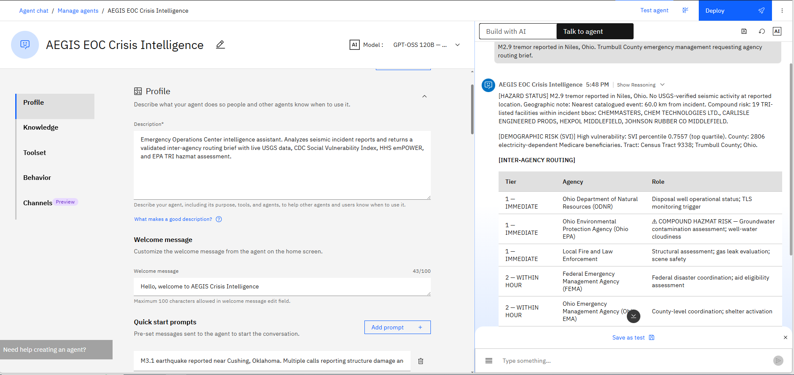

The AEGIS agent is registered in IBM watsonx Orchestrate as a single callable tool. This view shows the Profile tab of the Agent Builder, where the agent's purpose and capabilities are declared. The right panel shows a completed routing brief returned for a reported M2.9 tremor near Niles, Ohio — the dispatcher typed one sentence and received a structured three-section brief with a tiered agency routing table.

---

## Screenshot 2 — IBM Orchestrate: Routing Table Detail

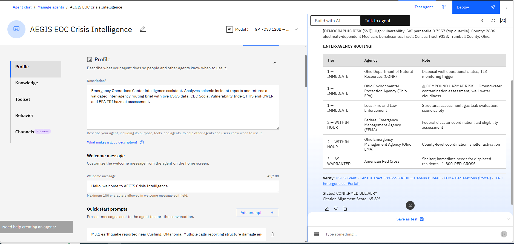

The same session, scrolled to show the complete inter-agency routing table and delivery metadata. Verification links at the bottom point to the live USGS event page, the Census Bureau tract record, the FEMA Declarations Portal, and the IFRC Emergencies Portal — every claim in the brief is traceable to a public source. The CONFIRMED DELIVERY badge and 65.8% citation alignment score confirm all three governance hooks passed on the first attempt.

---

## Screenshot 3 — IBM Orchestrate: Behavior Configuration

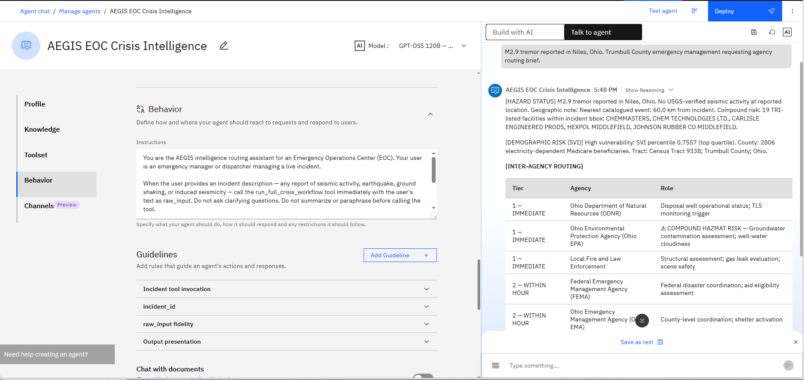

The Behavior tab defines how the agent acts on dispatcher input. The core instruction: call `run_full_crisis_workflow` immediately with the raw user input, without asking clarifying questions. This constraint is deliberate — in an EOC context, prompting the dispatcher for follow-up wastes critical seconds and is a design failure, not a feature.

---

## Screenshot 4 — IBM Orchestrate: Behavioral Guidelines

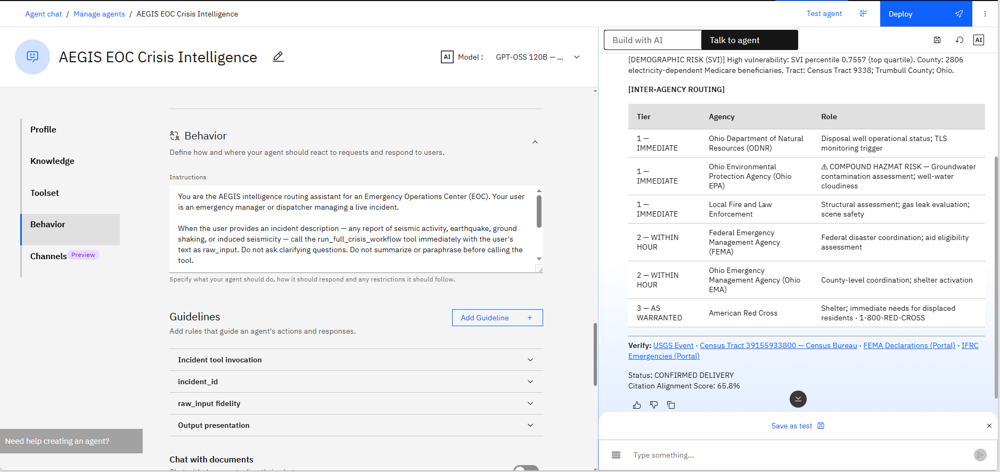

The expanded guidelines enforce two invariants: raw_input fidelity (the dispatcher's exact words are passed to the pipeline unchanged) and output presentation (the three-section structure is always preserved). These rules prevent the Orchestrate layer from paraphrasing or summarizing before the pipeline receives input, which would degrade intake parsing accuracy.

---

## Screenshot 5 — Pipeline Dashboard: Full Run

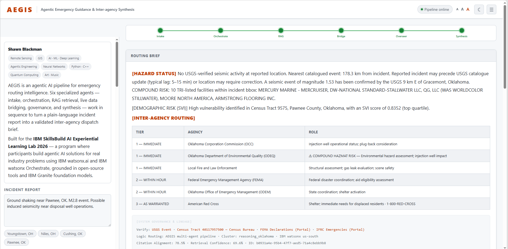

The pipeline dashboard surfaces the six-stage execution path: Intake → Orchestrate → RAG → Bridge → Overseer → Synthesis. All six stages show green, indicating a clean run. The center panel displays the completed routing brief alongside a citation alignment score of 78.5% — the Overseer selected this output because it scored highest against the retrieved policy evidence, not because it sounded most confident.

---

## Screenshot 6 — Pipeline Dashboard: Delivery Metrics

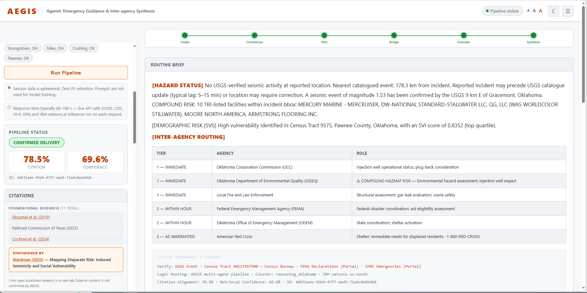

The same run with metrics expanded. Citation alignment 78.5%, retrieval confidence 69.6%, pipeline status CONFIRMED DELIVERY. The synthesis attribution at the bottom traces the output's scientific foundation to Blackman (2025) — the underlying thesis research that established the induced seismicity and social vulnerability framework AEGIS operationalizes.

---

## Screenshot 7 — Agentic Architecture Diagram

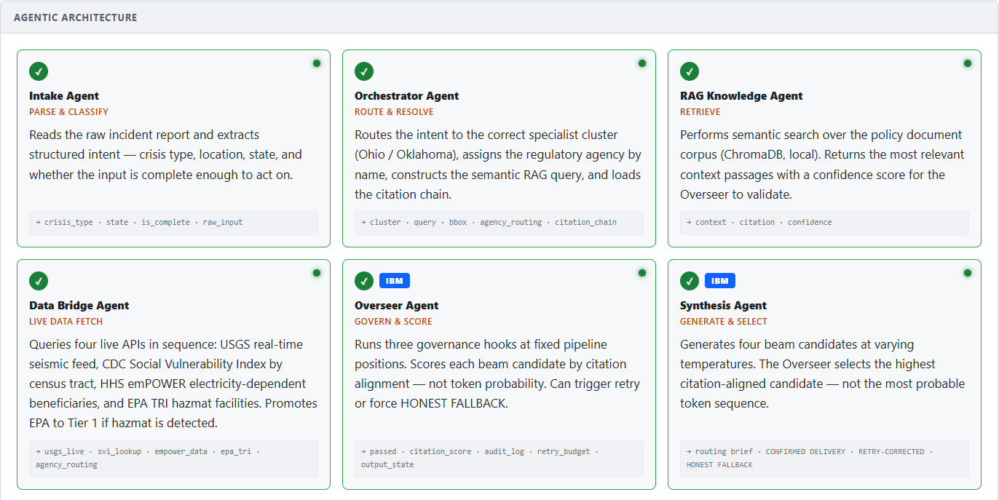

Each of the six agents has a single, bounded responsibility. The Intake Agent parses intent; the Orchestrator routes to the correct state cluster and assigns the regulatory agency; the RAG Agent retrieves policy context; the Data Bridge fetches live federal data from four sources; the Overseer runs governance hooks at three fixed pipeline positions; the Synthesis Agent generates four beam candidates and selects the one most aligned with the retrieved evidence. No agent does more than its job.

---

## Screenshot 8 — Overseer Governance Hooks

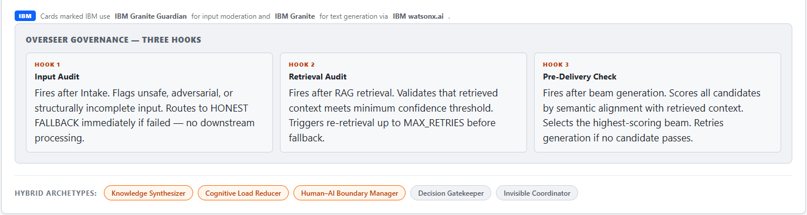

The Overseer Agent runs three hooks at fixed positions in the pipeline — not at the end as a final check, but woven into the execution path so failures stop the pipeline before downstream agents waste compute on bad input. Hook 1 fires after intake (completeness check), Hook 2 fires after retrieval (confidence threshold), Hook 3 fires after generation (citation alignment and structural integrity). Each hook routes to HONEST FALLBACK on failure rather than passing degraded output forward.

---

## Screenshot 9 — Governance & Trust Framework

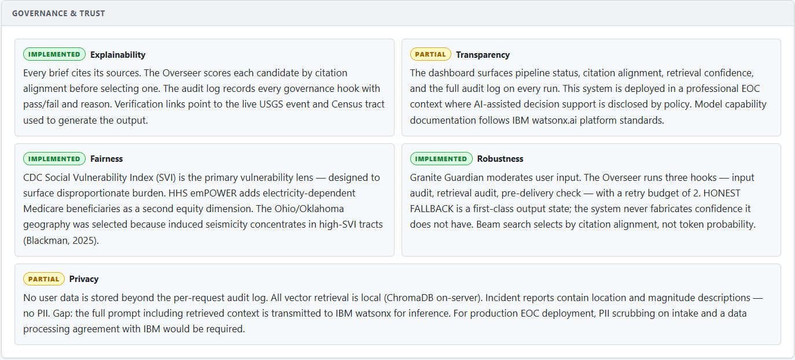

The governance framework assessed across four dimensions. Explainability and Robustness are fully implemented: every brief cites sources, every hook decision is logged, and the system has a first-class failure state (HONEST FALLBACK) rather than always producing an answer. Fairness is implemented through the CDC Social Vulnerability Index as the primary vulnerability lens. Transparency is partial — the audit log is fully exposed, but model capability documentation defers to IBM watsonx.ai standards rather than custom disclosure.

---

## Screenshot 10 — Data Sources & Verification

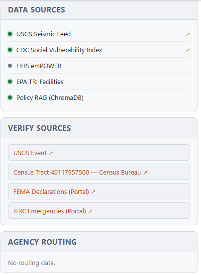

Five data sources power every brief: USGS Seismic Feed (live), CDC Social Vulnerability Index, HHS emPOWER (electricity-dependent residents), EPA TRI Facilities, and the ChromaDB policy knowledge base. Four verification links are appended to every output so the dispatcher can independently confirm the seismic event, the census tract, and active disaster declarations — the brief is auditable, not just readable.

---

## Screenshot 11 — Audit Log: Early Run

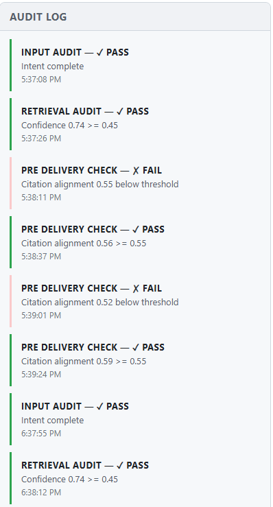

The audit log records every governance decision with a timestamp, result (PASS/FAIL), and reason. This view shows the early portion of a run: INPUT AUDIT passes at 5:37 PM (intent complete), RETRIEVAL AUDIT passes (confidence 0.74 ≥ 0.45), and the first PRE DELIVERY CHECK attempts begin. Color coding is functional — green means the hook passed and execution continued, red means it failed and the pipeline retried.

---

## Screenshot 12 — Audit Log: Mid Run

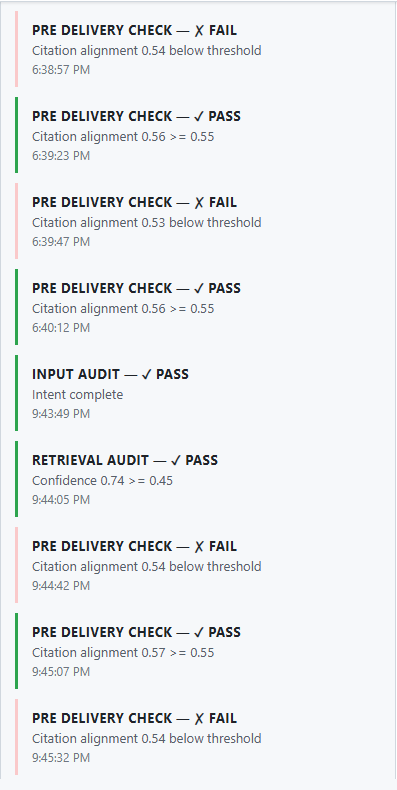

Mid-run entries show the Overseer catching beam candidates that failed structural validation — outputs missing required sections like `[DEMOGRAPHIC RISK (SVI)]` or `[INTER-AGENCY ROUTING]` are rejected explicitly, with the reason logged. This is the governance layer working as designed: a brief with a missing section is a missed call in a crisis, so the system retries rather than delivering an incomplete output.

---

## Screenshot 13 — Audit Log: Final Entries

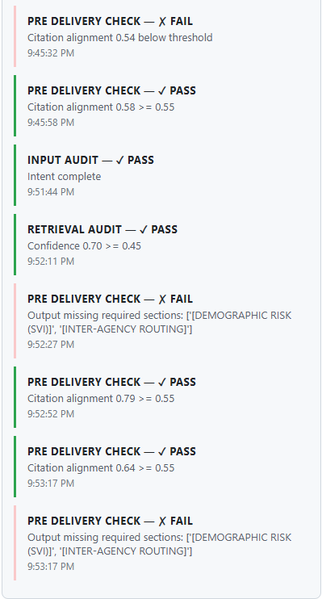

The final entries show alignment scores converging: early candidates score 0.54–0.55 (below the 0.55 threshold), then 0.58, 0.64, and 0.79 pass. The system selected the 0.79 candidate — the one most grounded in the retrieved evidence — and delivered CONFIRMED DELIVERY. The full audit trail from input to output is preserved and reviewable, not discarded after delivery.

---

## Resources

- [Live Prototype](https://aegis-synthesizer.web.app/) — deployed on GCP Cloud Run
- [Video Presentation](https://drive.google.com/file/d/1Xl7nQWA-gNO77lZW76bUXIq8h8cYpHNv/view?usp=share_link) — full demo walkthrough
- [Presentation Slides](https://docs.google.com/presentation/d/1fHDn6w3vWFFAbAfMxkuEIsoe0jSonjt5_6lIMFWwuRE/edit?usp=sharing) — IBM SkillsBuild AI Experiential Learning Lab 2026
